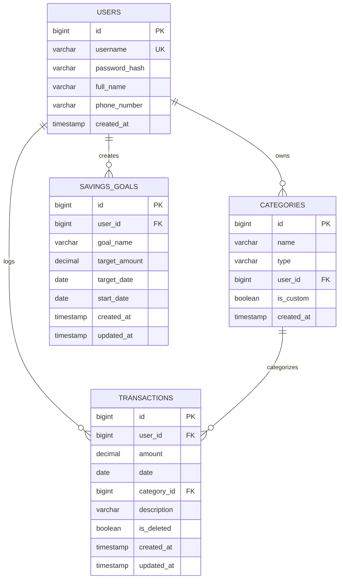

# Personal Finance Manager 

A production-quality **Personal Finance Manager** application built with Kotlin, Spring Boot 3.x, Spring Security (Session-based), Spring Data JPA, PostgreSQL / H2, Bean Validation, JaCoCo, Swagger UI, and a clean professional fintech web dashboard.

**Live Demo**: [https://personal-finance-manager-zh7c.onrender.com/](https://personal-finance-manager-zh7c.onrender.com/)

---

## Features

- **Session-Based Authentication**: Secure registration, login, and logout using BCrypt password hashing and HTTP session cookies (`JSESSIONID`).
- **Strict Data Isolation (Multi-Tenancy)**: Every database query is scoped by the authenticated user's ID to prevent cross-user data leakage.
- **Transaction Management**: Full CRUD operations for income and expense transactions with date immutability enforcement and dynamic filtering.
- **Category Management**: Built-in default categories (`Salary`, `Food`, `Rent`, `Transportation`, `Entertainment`, `Healthcare`, `Utilities`) plus custom categories with unique name constraints per user.
- **Savings Goals & Real-Time Progress**: Dynamic calculation of goal progress based on active user transactions between goal start date and current date.
- **Financial Reports**: Monthly and yearly aggregated financial breakdown by category name and net savings calculation using precise `BigDecimal` arithmetic.
- **OpenAPI / Swagger**: Interactive API documentation at `/swagger-ui/index.html`.

---

## Architecture

```text
Controller
    ↓
 Service
    ↓
Repository
    ↓
PostgreSQL / H2
```

### Layered Architecture & Separation of Concerns
1. **Controller**: Handles HTTP request parsing, DTO binding, `@Valid` bean validations, OpenAPI annotations, and delegates all business rules to services.
2. **Service**: Enforces business invariants (e.g. date immutability, goal progress calculations, multi-tenancy verification, unique custom category names, category deletion constraints).
3. **Repository**: Spring Data JPA repositories with custom JPQL queries enforcing user ID filters on all read/write operations.
4. **DTOs**: Clean request/response data classes decoupled from database entities.

### Session Authentication Management
- Implemented using Spring Security with `SessionCreationPolicy.IF_REQUIRED`.
- Authentication details stored in server-side HTTP session and tracked via secure HTTP cookie (`JSESSIONID`).
- Unauthenticated requests return standardized JSON `401 Unauthorized` responses.
- Forbidden cross-user resource access returns standardized JSON `403 Forbidden` responses.

### User Data Isolation
- Strictly enforced at the data access layer:
  - `findBy...AndUserId(...)`
  - `findAllFiltered(userId, ...)`
- Explicit integration test suite (`UserDataIsolationIntegrationTest`) verifies that User A cannot read, update, or delete User B's transactions, goals, categories, or reports.

### Production Readiness & PostgreSQL Compatibility
- **Database Agnostic Date Queries**: Avoids H2/PostgreSQL specific functions like `YEAR()` or `EXTRACT()`. Uses clean date-range comparisons compatible with all SQL dialects.
- **Strict Type Safety**: Enforces `VARCHAR` mapping for string fields to prevent PostgreSQL `bytea` inference errors.
- **Path Normalization**: Integrated `PathNormalizationFilter` to handle non-standard URLs (double slashes, trailing slashes) common in cloud environments and automated test suites.
- **Parameter Type Casting**: Uses explicit JPQL casting (`CAST(:param AS string)`) to solve PostgreSQL parameter type inference issues for optional filters.

### Savings Goal Calculation
- `currentProgress` = `total income - total expenses` considering user transactions where `goal.startDate <= transaction.date <= today`.
- `progressPercentage` = `(currentProgress / targetAmount) * 100` (handles division by zero safely).
- `remainingAmount` = `max(targetAmount - currentProgress, 0)`.
- Deleted transactions are automatically excluded.

### Report Generation
- Aggregates non-deleted user transactions grouped by category name.
- Net savings = `sum(INCOME) - sum(EXPENSE)` calculated strictly using `BigDecimal` arithmetic to prevent floating-point inaccuracy.

---

## Tech Stack

- **Language**: Kotlin 2.0.20 / Java 17+ (JDK 25 compatible)
- **Framework**: Spring Boot 3.3.3
- **Security**: Spring Security (BCrypt, Session Management)
- **Persistence**: Spring Data JPA, Hibernate, PostgreSQL (production), H2 (local/tests)
- **Validation**: Bean Validation (`jakarta.validation`)
- **API Documentation**: Springdoc OpenAPI / Swagger UI 2.6.0
- **Testing**: JUnit 5, MockK, Spring Security Test
- **Code Coverage**: JaCoCo (Target >= 80%)
- **Build System**: Gradle Kotlin DSL

---

## Database Schema



---

## API Documentation

### Authentication (`/api/auth`)
- `POST /api/auth/register` — Register a new user (`201 Created` / `409 Conflict`)
- `POST /api/auth/login` — Authenticate and establish HTTP session (`200 OK` / `401 Unauthorized`)
- `POST /api/auth/logout` — Invalidate HTTP session (`200 OK`)

### Categories (`/api/categories`)
- `GET /api/categories` — Get default and user custom categories (`200 OK`)
- `POST /api/categories` — Create custom category (`201 Created` / `409 Conflict`)
- `DELETE /api/categories/{name}` — Delete custom category (`200 OK` / `400` / `404` / `409`)

### Transactions (`/api/transactions`)
- `POST /api/transactions` — Create transaction (`201 Created` / `400 Bad Request`)
- `GET /api/transactions` — List filtered transactions (`startDate`, `endDate`, `categoryId`, `category`, `type`) (`200 OK`)
- `PUT /api/transactions/{id}` — Update transaction (date immutable) (`200 OK` / `403` / `404`)
- `DELETE /api/transactions/{id}` — Delete transaction (`200 OK` / `403` / `404`)

### Savings Goals (`/api/goals`)
- `POST /api/goals` — Create savings goal (`201 Created` / `400 Bad Request`)
- `GET /api/goals` — List all user goals with calculated progress (`200 OK`)
- `GET /api/goals/{id}` — Get single goal (`200 OK` / `403` / `404`)
- `PUT /api/goals/{id}` — Update goal (`200 OK` / `403` / `404`)
- `DELETE /api/goals/{id}` — Delete goal (`200 OK` / `403` / `404`)

### Financial Reports (`/api/reports`)
- `GET /api/reports/monthly/{year}/{month}` — Monthly income/expense breakdown & net savings (`200 OK` / `400`)
- `GET /api/reports/yearly/{year}` — Yearly income/expense breakdown & net savings (`200 OK` / `400`)

---

## Local Setup

### Prerequisites
- Java 17 or higher installed (`java -version`)
- Git

### Running Locally
```bash
git clone https://github.com/example/personal-finance-manager.git
cd personal-finance-manager
./gradlew bootRun
```

Access the application in your browser:

### Live Production
- **Web UI Dashboard**: [https://personal-finance-manager-zh7c.onrender.com/](https://personal-finance-manager-zh7c.onrender.com/)
- **Swagger UI**: [https://personal-finance-manager-zh7c.onrender.com/swagger-ui/index.html](https://personal-finance-manager-zh7c.onrender.com/swagger-ui/index.html)

### Local Development
- **Web UI Dashboard**: `http://localhost:8080/`
- **Swagger UI**: `http://localhost:8080/swagger-ui/index.html`
- **H2 Console**: `http://localhost:8080/h2-console` (Only available when running with H2 database)

---

## Environment Variables

| Variable | Description | Default / Example |
|---|---|---|
| `PORT` | Web server listening port | `8080` |
| `DB_HOST` | Database host | `localhost` |
| `DB_PORT` | Database port | `5432` |
| `DB_NAME` | Database name | `financedb` |
| `DB_USERNAME` | Database username | `postgres` |
| `DB_PASSWORD` | Database password | `password` |
| `DB_DRIVER` | Database JDBC driver class | `org.postgresql.Driver` |
| `DB_DIALECT` | Hibernate SQL dialect | `org.hibernate.dialect.PostgreSQLDialect` |

---
## 👨‍💻 Author

**Harshvardhan Singh**  
[](https://github.com/ItsDeadlyProgrammer)

---


